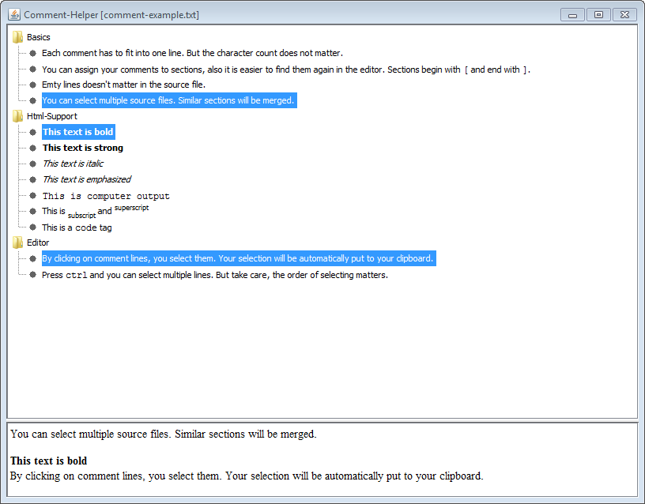

Introduction
============
Tool for merging muliple comments and putting to clipboard. Perfect for tutors, teachers and online marking.

Features
========
 * selection multiple comment lines
 * html tag support
 * multiple source files
 * selection is automatically put to clipboard
 * comments can be grouped in sections
 * Merging of similar sections

Usage
=====
 1. Download repository & import in eclipse as project.
 2. Start comment-helper and choose the comment-example.txt file.
 2. Look at the comment-example.txt and learn more about syntax.
 3. Write your own comment source files.
